# SpringBoot教程

# 一、什么是Spring Boot

## 1 Spring Boot概述

Spring Boot是Spring开源组织下的子项目，是Spring组件一站式解决方案，主要是简化了使用Spring的难度，简省了繁重的配置，提供了各种启动器，开发者能快速上手。

官网：http://projects.spring.io/spring-boot/

## 2 Spring Boot的优点

- 使用 Spring 项目引导页面可以在几秒构建一个项目
- 方便对外输出各种形式的服务，如 REST API、WebSocket、Web、Streaming、Tasks
- 非常简洁的安全策略集成
- 支持关系数据库和非关系数据库
- 支持运行期内嵌容器，如 Tomcat、Jetty
- 强大的开发包，支持热启动
- 自动管理依赖自带应用监控
- 支持各种 IED，如 IntelliJ IDEA 、NetBeans

## 3 Spring Boot核心功能

### 3.1 起步依赖

起步依赖本质上是一个Maven项目对象模型（Project Object Model，POM），定义了对其他库的传递依赖，这些东西加在一起即支持某项功能。

### 3.2 自动配置

Spring Boot的自动配置是一个运行时（更准确地说，是应用程序启动时）的过程，考虑了众多因素，才决定Spring配置应该用哪个，不该用哪个。该过程是Spring自动完成的。


# 二、Spring Boot快速入门

下面开始搭建Spring Boot的入门程序

## 1 创建项目


## 2 导入依赖

```xml
<?xml version="1.0" encoding="UTF-8"?>
<project xmlns="http://maven.apache.org/POM/4.0.0"
         xmlns:xsi="http://www.w3.org/2001/XMLSchema-instance"
         xsi:schemaLocation="http://maven.apache.org/POM/4.0.0 http://maven.apache.org/xsd/maven-4.0.0.xsd">
    <modelVersion>4.0.0</modelVersion>

    <groupId>com.gaosong</groupId>
    <artifactId>springboot_hello</artifactId>
    <version>1.0</version>

    <!--导入springboot父工程-->
    <!--父工程的作用：锁定起步的版本号，并没有真正的依赖-->
    <parent>
        <groupId>org.springframework.boot</groupId>
        <artifactId>spring-boot-starter-parent</artifactId>
        <version>2.1.11.RELEASE</version>
    </parent>
    <dependencies>
        <!--web起步依赖-->
        <dependency>
            <groupId>org.springframework.boot</groupId>
            <artifactId>spring-boot-starter-web</artifactId>
        </dependency>
    </dependencies>

</project>
```

SpringBoot程序导入的依赖叫起步依赖，其实就是对依赖的简化。

## 3 编写引导类

```java
package com.yiidian;
import org.springframework.boot.SpringApplication;
import org.springframework.boot.autoconfigure.SpringBootApplication;
/**
 * Spring Boot引导类
 * 一点教程网 - www.yiidian.com
 */
@SpringBootApplication
public class MyBootApplication {

    public static void main(String[] args) {
        SpringApplication.run(MyBootApplication.class,args);
    }
    
}
```

引导类是SpringBoot特色，每个SpringBoot应用都需要有一个引导类来启动程序。

## 4 编写Controller类

```java
package com.gaosong.controller;

import org.springframework.stereotype.Controller;
import org.springframework.web.bind.annotation.GetMapping;
import org.springframework.web.bind.annotation.ResponseBody;

/**
 * 控制器
 * @Author gaosong
 * @Date 2021/1/12 17:18
 * @Version 1.0
 */
@Controller
public class HelloController {
    
    @GetMapping("/hello") //get访问的映射路径
    @ResponseBody
    public String hello(){
        return "欢迎使用第一个springboot项目";
    }
}
package com.yiidian.controller;
import org.springframework.stereotype.Controller;
import org.springframework.web.bind.annotation.RequestMapping;
import org.springframework.web.bind.annotation.ResponseBody;
/**
 * 控制器
 */
@Controller
public class HelloController {
    
    @RequestMapping("/hello")
    @ResponseBody
    public String hello(){
        return "欢迎来到一点教程网";
    }
}
```

## 5 执行引导类

运行引导类的main方法，查看控制器日志


## 6 访问测试

http://localhost:8080/hello


 

源码下载：https://pan.baidu.com/s/1Jrxp9oye-yvVzGKpMrFUBg


# 三、Spring boot 配置文件

Spring Boot的核心是自动配置（或者叫默认配置），通过自动配置大大减少Spring项目的配置编写。但是在实际开发中，我们仍然需要根据需求来适当修改某些必要的参数配置，这时Spring Boot提供了两种格式的配置方便开发者进行修改。

- applicaiton*.properties
- application*.yml（或者application*.yaml）

## 1 application*.properties

### 1.1 Spring Boot内置属性

Spring Boot使用了一个全局的配置文件application.properties，放在src/main/resources目录下或者src/main/resources/config下。在 src/main/resources/config 下的优先级高 。Sping Boot的全局配置文件的作用是对一些默认配置的配置值进行修改。下面以修改Tomcat的访问端口为例：

1）建立application.properties配置

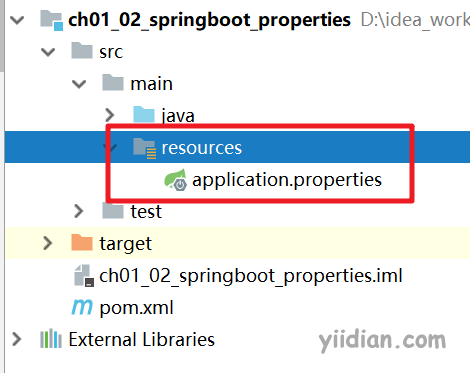

2）编写修改Tomcat端口属性

Tomcat的默认是8080，改为8888

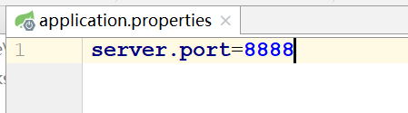

3）运行引导类，访问端口已经改变

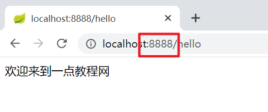

除了Tomcat端口以外，Spring Boot还定义了大量的内置属性，以下链接为Spring Boot官方提供的参考：

https://docs.spring.io/spring-boot/docs/2.1.11.RELEASE/reference/htmlsingle/#boot-features-external-config-application-property-files

### 1.2 自定义属性

1）基本类型

```ini
nickname=eric
age=20
```

2）JavaBean类型

```ini
user.nickname=eric
user.age=20
```

3）数组/List集合

```ini
user.list=eric,jack,rose
```

或者

```ini
user.list[0]=eric
user.list[1]=jack
user.list[2]=rose
```

4）Map集合

```ini
user.map={nickname:'eric',age:20}
```

### 或者

```ini
user.map.nickname=eric
user.map.age=20
```

### 1.3 Profile多环境配置

当应用程序需要部署到不同运行环境时，一些配置细节通常会有所不同，最简单的比如日志，生产日志会将日志级别设置为WARN或更高级别，并将日志写入日志文件，而开发的时候需要日志级别为DEBUG，日志输出到控制台即可。如果按照以前的做法，就是每次发布的时候替换掉配置文件，这样太麻烦了，Spring Boot的Profile就给我们提供了解决方案，命令带上参数就搞定。

这里我们来模拟一下，只是简单的修改Tomcat端口来测试：

**1）建立不同环境的application.properties文件**

在Spring Boot中多环境配置文件名需要满足application-{profile}.properties的格式，其中{profile}对应你的环境标识，比如：

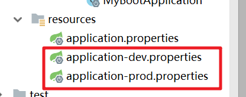

**2）每个文件里面的Tomcat访问端口不同**

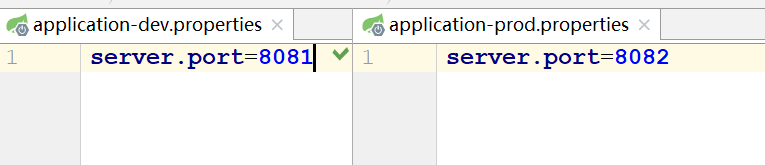

在原来的application.yml里，指定需要激活的配置

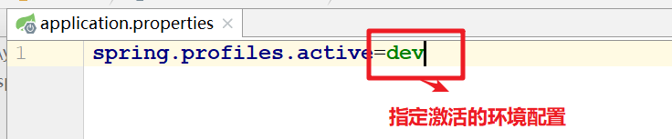

**3）运行引导类，查看结果**

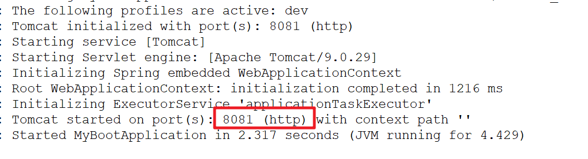从结果看到，激活的配置是application-dev.yml。

 

源码下载：https://pan.baidu.com/s/1nOe_TvwPQFwOWjUM5O57Mw

## 2 application*.yml

### 1.1 yml格式简介

yml或yaml所表示的YAML Ain’t Markup Language，YAML是一种简洁的非标记语言，文件名后缀为yml，java中经常用它描述配置文件application.yml。YAML以数据为中心，比json/xml等更适合做配置文件。使用空白，缩进，分行组织数据，从而使得表示更加简洁易读。

在yml之前使用最多的配置文件形式是xml和properties文件。xml文件太过繁琐，看过的人都知道，想要新加一个配置节点的话还需要包含在<>标签里；而properties配置文件没有了标签，不过当你的配置有很多层级的时候，写完之后你会发现会有大量重复的代码。而yml/yaml文件结合了两者的优势，当你新增节点配置的时候，不需要标签，在写多层级配置的时候也不会产生重复代码。

### 1.2 yml格式书写规则

1. 大小写敏感
2. 使用缩进表示层级关系
3. 禁止使用tab缩进，只能使用空格键
4. 缩进长度没有限制，只要元素对齐就表示这些元素属于一个层级。
5. 使用#表示注释
6. 字符串可以不用引号标注

### 1.3 Spring Boot内置属性

yml格式也修改Spring Boot默认的属性配置，如下：

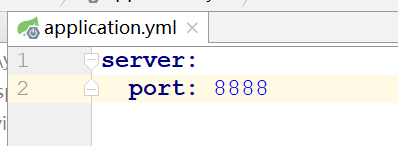

### 1.3 自定义属性

yml格式也可以自定义丰富的数据类型

1）基本类型

```ini
nickname: eric
age: 20
```

 注意：属性值大小写敏感

2）JavaBean类型

```ini
user:
  nickname: eric
  age: 20
```

3）数组/List集合

```ini
users:
  list:
  - eric
  - jack
  - rose
```

4）Map集合

```ini
user:
  map: {nickname: erci,age: 20}
```

### 1.4 Profile多环境配置

yml格式也可以定义不同环境的配置，在启动时指定环境配置

**1）定义不同环境的yml配置**

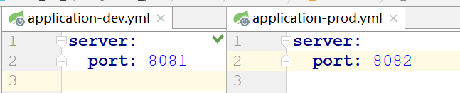

**2）指定环境名称**

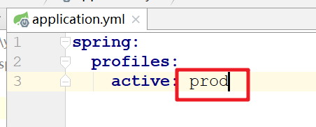

**3）运行测试**

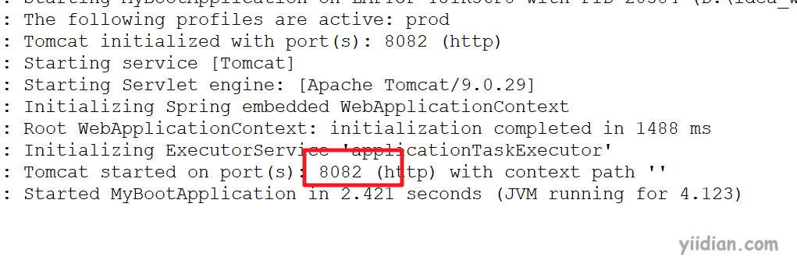

从结果可以看到，使用的是application-prod.yml配置。

 

源码下载：https://pan.baidu.com/s/17Ns9NGX2pkISsfl_vrkeZQ


# 四、Spring Boot读取properties

Spring Boot里面有两个注解可以读取application.properties或application.yml文件的属性值。

1. @Value
2. @ConfigurationProperties

## 1 @Value

### 1.1 基本类型

1）配置

```ini
nickname=eric
age=20
```

2）SpringBoot读取配置

```java
/**
 * @Value注解 - 读取application.properties属性
 * 
 */
@Controller
public class ConfigController {

    //1.1 读取基本类型
    @Value("${nickname}")
    private String nickname;
    @Value("${age}")
    private Integer age;
```

### 1.2 JavaBean类型

1）配置

```ini
user.nickname=jack
user.age=18
```

2）SpringBoot读取配置

```java
/**
 * @Value注解 - 读取application.properties属性
 * 一点教程网 - www.yiidian.com
 */
@Controller
public class Config2Controller {

    //1.2 读取JavaBean类型
    @Value("${user.nickname}")
    private String nickname;
    @Value("${user.age}")
    private Integer age;
```

### 1.3 数组/List集合

1）配置

```ini
user.list=eric,jack,rose
```

2）SpringBoot读取配置

```java
/**
 * @Value注解 - 读取application.properties属性
 * 
 */
@Controller
public class Config3Controller {

    //1.3 读取数组/List集合类型
    @Value("#{'${user.list}'.split(',')}")
    private List<String> list;
```

### 1.3 Map集合

1）配置

```ini
user.map={nickname:'eric',age:20}
```

2）SpringBoot读取配置

```java
/**
 * @Value注解 - 读取application.properties属性
 * 
 */
@Controller
public class Config4Controller {

    //1.4 读取Map集合类型
    @Value("#{${user.map}}")
    private Map<String,Object> map;
```

## 2 @ConfigurationProperties

### 2.1 基本类型

1）配置

```ini
nickname=eric
age=20
```

2）SpringBoot读取配置

```java
/**
 * @ConfigurationProperties注解 - 读取application.properties属性
 * 
 */
@Controller
@ConfigurationProperties(prefix = "")
public class Config5Controller {

    //1.1 读取基本类型
    private String nickname;
    private Integer age;
    public void setNickname(String nickname) {
        this.nickname = nickname;
    }
    public void setAge(Integer age) {
        this.age = age;
    }
```

注意以下几点：

- prefix：代表属性的前缀，如果user.nickname前缀就是user
- 属性名称必须和properties文件的属性名保持一致
- 属性必须提供setter方法来注入文件的属性值

### 2.2 JavaBean类型

1）配置

```ini
user.nickname=jack
user.age=18
```

2）SpringBoot读取配置

```java
/**
 * @ConfigurationProperties注解 - 读取application.properties属性
 * 
 */
@Controller
@ConfigurationProperties(prefix = "user")
public class Config6Controller {

    //1.2 读取JavaBean类型
    private String nickname;
    private Integer age;

    public void setNickname(String nickname) {
        this.nickname = nickname;
    }

    public void setAge(Integer age) {
        this.age = age;
    }
```

### 2.3 数组/List集合

1）配置

```ini
user.list2[0]=eric
user.list2[1]=jack
user.list2[2]=rose
```

2）SpringBoot读取配置

```java
/**
 * @ConfigurationProperties注解 - 读取application.properties属性
 * 
 */
@Controller
@ConfigurationProperties(prefix = "user")
public class Config7Controller {

    //1.3 读取数组/List集合类型
    private List<String> list2;
    public void setList2(List<String> list2) {
        this.list2 = list2;
    }
```

### 2.4 Map集合

1）配置

```ini
user.map2.nickname=eric
user.map2.age=20
```

2）SpringBoot读取配置

```java
/**
 * @ConfigurationProperties注解 - 读取application.properties属性
 * 
 */
@Controller
@ConfigurationProperties(prefix = "user")
public class Config8Controller {

    //1.4 读取Map集合类型
    private Map<String,Object> map2;
    public void setMap2(Map<String, Object> map2) {
        this.map2 = map2;
    }
```

 

源码下载：https://pan.baidu.com/s/1eAwxjQClVt3TxuqtL6VbIA


# 五、Spring Boot读取yml

Spring Boot也可以通过@Value和@ConfigurationProperties注解来读取application.yml文件的属性值。

## 1 @Value

### 1.1 基本类型

1）配置

```ini
nickname: eric
age: 20
```

2）SpringBoot读取配置

```java
/**
 * @Value注解 - 读取application.yml
 * 
 */
@Controller
public class ConfigController {

    //1.1 读取基本类型
    @Value("${nickname}")
    private String nickname;
    @Value("${age}")
    private Integer age;
```

### 1.2 JavaBean类型

1）配置

```ini
user:
  nickname: jack
  age: 18
```

2）SpringBoot读取配置

```java
/**
 * @Value注解 - 读取application.yml属性
 * 
 */
@Controller
public class Config2Controller {

    //1.2 读取JavaBean类型
    @Value("${user.nickname}")
    private String nickname;
    @Value("${user.age}")
    private Integer age;
```

### 1.3 数组/List集合

1）配置

```ini
user:
  list: eric,jack,rose
```

2）SpringBoot读取配置

```java
/**
 * @Value注解 - 读取application.yml属性
 */
@Controller
public class Config3Controller {

    //1.3 读取数组/List集合类型
    @Value("#{'${user.list}'.split(',')}")
    private List<String> list;
```

### 1.3 Map集合

1）配置

```ini
user:
  map: "{nickname: 'eric',age: 20}"
```

2）SpringBoot读取配置

```java
/**
 * @Value注解 - 读取application.yml属性
 */
@Controller
public class Config4Controller {

    //1.4 读取Map集合类型
    @Value("#{${user.map}}")
    private Map<String,Object> map;
```

## 2 @ConfigurationProperties

### 2.1 基本类型

1）配置

```ini
nickname: eric
age: 20
```

2）SpringBoot读取配置

```java
/**
 * @ConfigurationProperties注解 - 读取application.yml属性
 */
@Controller
@ConfigurationProperties(prefix = "")
public class Config5Controller {

    //1.1 读取基本类型
    private String nickname;
    private Integer age;
    public void setNickname(String nickname) {
        this.nickname = nickname;
    }
    public void setAge(Integer age) {
        this.age = age;
    }
```

注意以下几点：

- prefix：代表属性的前缀，如果user.nickname前缀就是user
- 属性名称必须和properties文件的属性名保持一致
- 属性必须提供setter方法来注入文件的属性值

### 2.2 JavaBean类型

1）配置

```ini
user:
  nickname: jack
  age: 18
```

2）SpringBoot读取配置

```java
/**
 * @ConfigurationProperties注解 - 读取application.yml属性
 */
@Controller
@ConfigurationProperties(prefix = "user")
public class Config6Controller {

    //1.2 读取JavaBean类型
    private String nickname;
    private Integer age;

    public void setNickname(String nickname) {
        this.nickname = nickname;
    }

    public void setAge(Integer age) {
        this.age = age;
    }
```

### 2.3 数组/List集合

1）配置

```ini
user:
  list2:
  - eric
  - jack
  - rose
```

2）SpringBoot读取配置

```java
/**
 * @ConfigurationProperties注解 - 读取application.properties属性
 */
@Controller
@ConfigurationProperties(prefix = "user")
public class Config7Controller {

    //1.3 读取数组/List集合类型
    private List<String> list2;
    public void setList2(List<String> list2) {
        this.list2 = list2;
    }
```

### 2.4 Map集合

1）配置

```ini
user:
  map2: {nickname: eric,age: 20}
```

2）SpringBoot读取配置

```java
/**
 * @ConfigurationProperties注解 - 读取application.yml属性
 */
@Controller
@ConfigurationProperties(prefix = "user")
public class Config8Controller {

    //1.4 读取Map集合类型
    private Map<String,Object> map2;
    public void setMap2(Map<String, Object> map2) {
        this.map2 = map2;
    }
```

 

源码下载：https://pan.baidu.com/s/1RlaWfEdx1xGZA08N6adIbQ


# 六、Spring Boot热部署

## 1 什么是热部署

在实际开发过程中，每次修改代码就得将项目重启，重新部署，对于一些大型应用来说，重启时间需要花费大量的时间成本。对于一个后端开发者来说，重启过程确实很难受啊。在 Java 开发领域，热部署一直是一个难以解决的问题，目前的 Java 虚拟机只能实现方法体的修改热部署，对于整个类的结构修改，仍然需要重启虚拟机，对类重新加载才能完成更新操作。下面我们就看看对于Spring Boot应用热部署怎么实现。

## 2 热部署原理

深层原理是使用了两个ClassLoader，一个Classloader加载那些不会改变的类（第三方Jar包），另一个ClassLoader加载会更改的类，称为restart ClassLoader,这样在有代码更改的时候，原来的restart ClassLoader 被丢弃，重新创建一个restart ClassLoader，由于需要加载的类相比较少，所以实现了较快的重启时间。

## 3 Spring Boot热部署实现方式

Spring Boot有3种热部署方式：

1. 使用springloaded配置pom.xml文件，使用mvn spring-boot:run启动
2. 使用springloaded本地加载启动，配置jvm参数
3. 使用devtools工具包，操作简单，但是每次需要重新部署

接着我们主要讲解第三种devtools热部署方式的使用，因为一个项目只要使用一种即可，而第三种实现方式最简单！

## 4 Spring Boot热部署实现步骤

### 4.1 在pom.xml中添加依赖

```xml
<!--devtools热部署-->
<dependency>
    <groupId>org.springframework.boot</groupId>
    <artifactId>spring-boot-devtools</artifactId>
    <optional>true</optional>
    <scope>true</scope>
</dependency>
```

需要说明以下几点：

1. devtools可以实现页面热部署（即页面修改后会立即生效，这个可以直接在application.properties文件中配置spring.thymeleaf.cache=false来实现）
2. 实现类文件热部署（类文件修改后不会立即生效）
3. 实现对属性文件的热部署。即devtools会监听classpath下的文件变动，并且会立即重启应用（发生在保存的时候）。这里可能有疑问，为什么还要重启？这样就不是热部署啦！注意：因为其采用的虚拟机机制，该项重启比正常重启会快非常多！
4. scope配置为true，在修改java文件后就立即热启动，而且会清空Session中的数据。如果有用户登陆的话，项目重启后需要重新登陆。

### 4.2 devtools的配置

application.yml可以添加devtools的配置

```ini
spring:
 devtools:
   restart:
     enabled: true  #设置开启热部署
     additional-paths: src/main/java #重启目录
     exclude: WEB-INF/**
 freemarker:
   cache: false    #页面不加载缓存，修改即时生效
```

### 4.3 IDEA中配置

当我们修改了类文件后，IDEA不会自动编译，必须修改IDEA设置。

1）File-Settings-Compiler-Build Project automatically

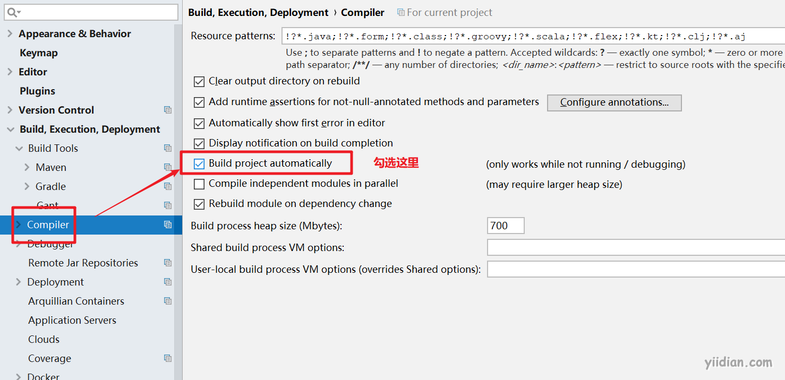

2）ctrl + shift + alt + / ，选择Registry,勾上 Compiler autoMake allow when app running

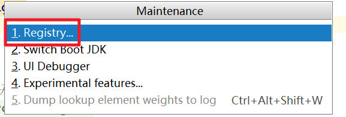

 

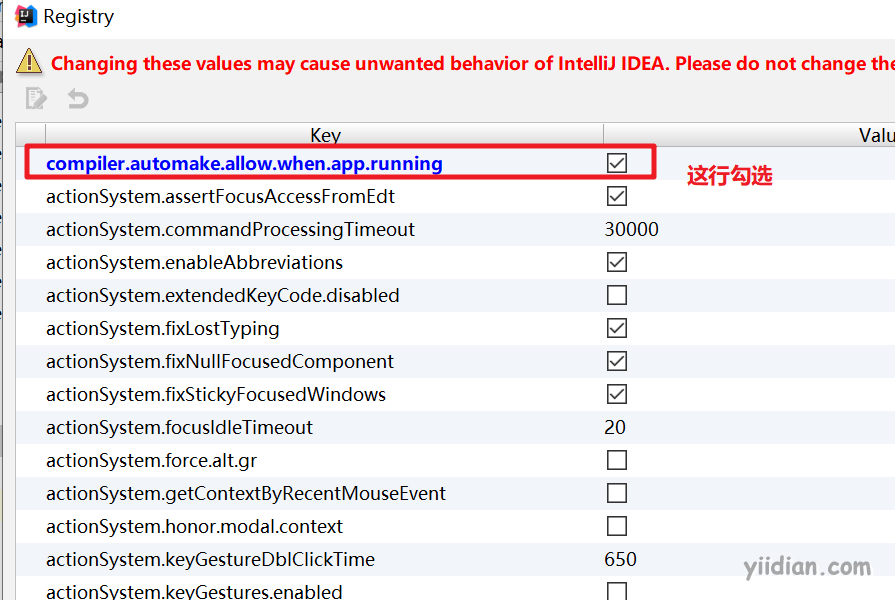

### 4.4 运行测试

- 修改类–>保存：应用会重启
- 修改配置文件–>保存：应用会重启
- 修改页面–>保存：应用不会重启，但会重新加载，页面会刷新


# 七、Spring Boot访问静态资源

## 1 Spring Boot默认静态资源目录

在Spring Boot应用启动过程中，会读取加载一个静态资源文件加载路径这个属性

```ini
# 默认值为
spring.resources.static-locations=classpath:/META-INF/resources/,classpath:/resources/,classpath:/static/,classpath:/public/
```

这个属性的默认值代表静态资源扫描目录：

```ini
classpath:/META-INF/resources/ 
classpath:/resources/
classpath:/static/ 
classpath:/public/
/：当前项目的根路径
```

这意味着我们可以只要把静态资源文件存放在以上目录，即可以被访问到！

例如：

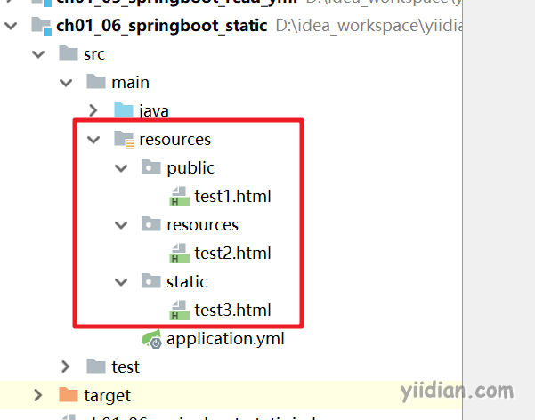

我们分别建立了public、resources、static目录，在目录下建立html静态页面。项目启动后，我们都可以直接访问这些页面：

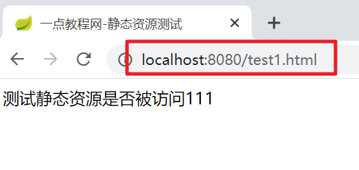

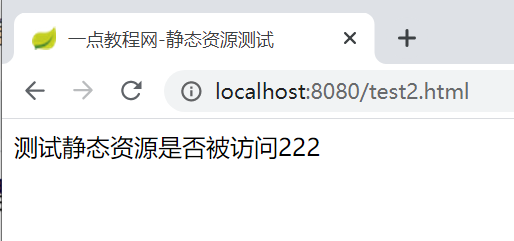

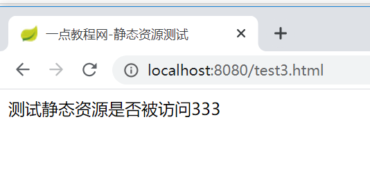

这里要注意优先级问题：根据前后关系确定优先级，也就是说如果classpath:/resources/目录和classpath:/public/都有一个test.html，那么根据默认的优先级，会去访问classpath:/resources/下的资源。

## 2 修改Spring Boot静态资源路径

我们可以在application.yml文件中修改静态资源路径，如：

```ini
# 修改静态资源加载路径
spring:
  resources:
    static-locations: classpath:/yiidian
```

但注意，如果按照以上写法会覆盖Spring Boot的默认路径。如果希望保留默认路径，那就要先写上之前所有值，再最后加上新的路径。

 

源码下载：https://pan.baidu.com/s/1Cq8nFhF0G4cxOobJBk4zbQ


