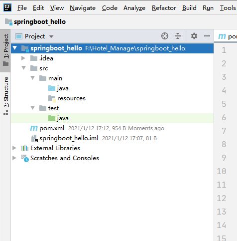
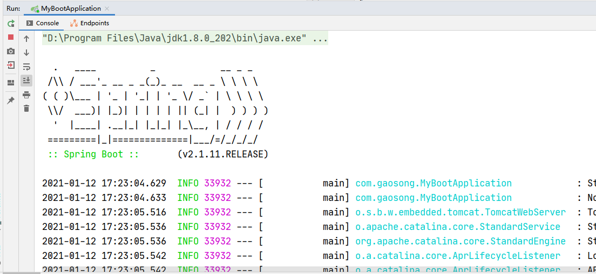
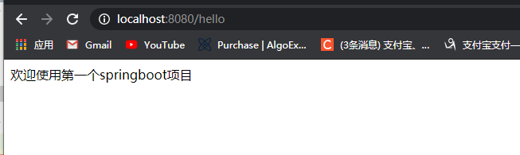

# SpringBoot教程

# 一、什么是Spring Boot

## 1 Spring Boot概述

Spring Boot是Spring开源组织下的子项目，是Spring组件一站式解决方案，主要是简化了使用Spring的难度，简省了繁重的配置，提供了各种启动器，开发者能快速上手。

官网：http://projects.spring.io/spring-boot/

## 2 Spring Boot的优点

- 使用 Spring 项目引导页面可以在几秒构建一个项目
- 方便对外输出各种形式的服务，如 REST API、WebSocket、Web、Streaming、Tasks
- 非常简洁的安全策略集成
- 支持关系数据库和非关系数据库
- 支持运行期内嵌容器，如 Tomcat、Jetty
- 强大的开发包，支持热启动
- 自动管理依赖自带应用监控
- 支持各种 IED，如 IntelliJ IDEA 、NetBeans

## 3 Spring Boot核心功能

### 3.1 起步依赖

起步依赖本质上是一个Maven项目对象模型（Project Object Model，POM），定义了对其他库的传递依赖，这些东西加在一起即支持某项功能。

### 3.2 自动配置

Spring Boot的自动配置是一个运行时（更准确地说，是应用程序启动时）的过程，考虑了众多因素，才决定Spring配置应该用哪个，不该用哪个。该过程是Spring自动完成的。


## 二、Spring Boot快速入门

下面开始搭建Spring Boot的入门程序

## 1 创建项目



## 2 导入依赖

```xml
<?xml version="1.0" encoding="UTF-8"?>
<project xmlns="http://maven.apache.org/POM/4.0.0"
         xmlns:xsi="http://www.w3.org/2001/XMLSchema-instance"
         xsi:schemaLocation="http://maven.apache.org/POM/4.0.0 http://maven.apache.org/xsd/maven-4.0.0.xsd">
    <modelVersion>4.0.0</modelVersion>

    <groupId>com.gaosong</groupId>
    <artifactId>springboot_hello</artifactId>
    <version>1.0</version>

    <!--导入springboot父工程-->
    <!--父工程的作用：锁定起步的版本号，并没有真正的依赖-->
    <parent>
        <groupId>org.springframework.boot</groupId>
        <artifactId>spring-boot-starter-parent</artifactId>
        <version>2.1.11.RELEASE</version>
    </parent>
    <dependencies>
        <!--web起步依赖-->
        <dependency>
            <groupId>org.springframework.boot</groupId>
            <artifactId>spring-boot-starter-web</artifactId>
        </dependency>
    </dependencies>

</project>
```

SpringBoot程序导入的依赖叫起步依赖，其实就是对依赖的简化。

## 3 编写引导类

```java
package com.yiidian;
import org.springframework.boot.SpringApplication;
import org.springframework.boot.autoconfigure.SpringBootApplication;
/**
 * Spring Boot引导类
 * 一点教程网 - www.yiidian.com
 */
@SpringBootApplication
public class MyBootApplication {

    public static void main(String[] args) {
        SpringApplication.run(MyBootApplication.class,args);
    }
    
}
```

引导类是SpringBoot特色，每个SpringBoot应用都需要有一个引导类来启动程序。

## 4 编写Controller类

```java
package com.gaosong.controller;

import org.springframework.stereotype.Controller;
import org.springframework.web.bind.annotation.GetMapping;
import org.springframework.web.bind.annotation.ResponseBody;

/**
 * 控制器
 * @Author gaosong
 * @Date 2021/1/12 17:18
 * @Version 1.0
 */
@Controller
public class HelloController {
    
    @GetMapping("/hello") //get访问的映射路径
    @ResponseBody
    public String hello(){
        return "欢迎使用第一个springboot项目";
    }
}
package com.yiidian.controller;
import org.springframework.stereotype.Controller;
import org.springframework.web.bind.annotation.RequestMapping;
import org.springframework.web.bind.annotation.ResponseBody;
/**
 * 控制器
 * 一点教程网 - www.yiidian.com
 */
@Controller
public class HelloController {
    
    @RequestMapping("/hello")
    @ResponseBody
    public String hello(){
        return "欢迎来到一点教程网";
    }
}
```

## 5 执行引导类

运行引导类的main方法，查看控制器日志



## 6 访问测试

http://localhost:8080/hello



 

源码下载：https://pan.baidu.com/s/1Jrxp9oye-yvVzGKpMrFUBg

